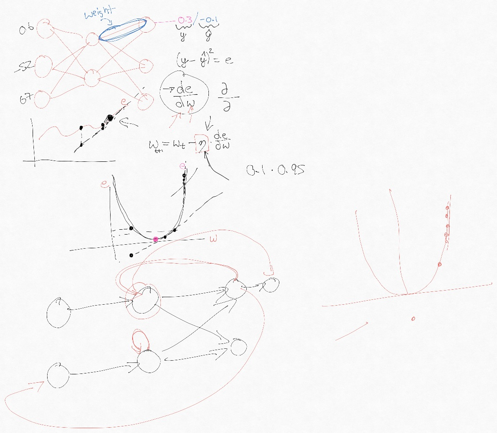
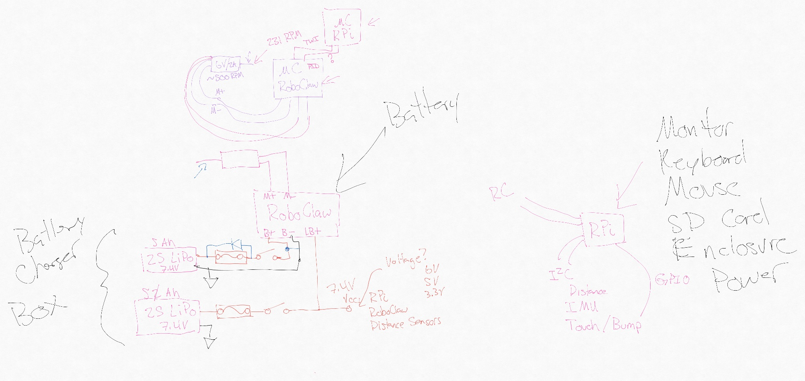

# Summary

| Date  | Notes
| :---- | :----
| 09/14 | Installed UE5 on lab machine
| 09/15 | Installed fastai on server
| 09/16 | Followed along with UE5 tutorials
| 09/17 | Followed along with fastai tutorials
| 09/18 | Worked on robot hardware

# Activities

## Researched Computers

We will be using [Unreal Engine 5](https://www.unrealengine.com/en-US/blog/a-first-look-at-unreal-engine-5) in this project, and it has a [recommended set of minimal computing requirements](https://docs.unrealengine.com/en-US/GettingStarted/RecommendedSpecifications/index.html). Digging around online I found the following as recommended by developers:

- Windows 10 64-bit
- Quad-core Intel or AMD, 2.5 GHz or faster
- 16 GB RAM or more
- 1 TB SSD or more
- 8 GB or more video memory
- DirectX 12 compatible graphics card

## Deep Learning

For deep learning, we will be using the [fastai library](https://docs.fast.ai/). The current version is built on [PyTorch](https://pytorch.org/) and it incorporates many best-practices by default.

*Figure 1: Image from our gradient descent discussion.*

Figure 1 is not very related, but I wanted an example image.

## Robot Hardware

Since we are using an [NVIDIA Jetson Nano] (https://www.nvidia.com/en-us/autonomous-machines/embedded-systems/jetson-nano/) I spent some time researching what all is needed and how to set it up. For example:

- [motors](https://www.pololu.com/product/4804)
- [motor controllers](https://www.pololu.com/product/3284)
- [batteries](https://www.amazon.com/Zeee-Batteries-Dean-Style-Connector-Vehicles/dp/B076Z778MJ)

To power the Nano and motors we need a less-than-simple power circuit.

*Figure 2: Image from our circuit diagram discussion.*

Figure 2 depicts the circuit diagram we will need for powering the Nano, motors, sensors, etc. It is probably best to use a separate battery for the motors and ICs as shown in the figure.

# Issues

[Any roadblocks you have encountered or issues that you want to discuss.  Please include as many details as possible.]

# Plans

My main plain for the upcoming week is to (this is too much for one person):

- work on the simulation,
- work on the circuit diagrams for the physical robot,
- work on the CAD design of the chassis,
- start setting up the deep learning pipeline, and
- start working with the Nano and cameras.

# Article Summaries

None this week. So I should just remove this section.
